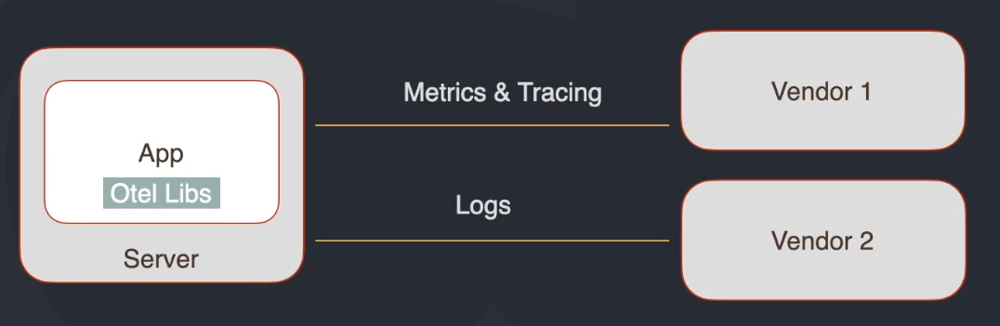
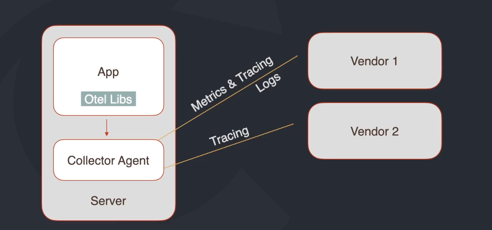
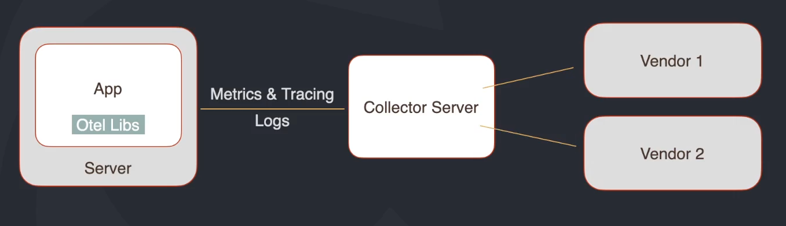

# Open Telemetry

## Contexto

1. Observabilidade
   - Logs: eventos que aconteceram no passado que ajudam a resolver problemas no futuro.
   - Métricas: recursos da máquinas e métricas de negócio para apoiar na tomada de decisão.
   - Tracing: rastreabilidade, saber onde o problema está acontecendo.
2. Centralização da informação.
3. Necessidade de customização das informações:
   - Geração de métricas de negócio
   - Tracing de rotinas e blocos internos da aplicação para garantir a perfomance e previsibilidade da aplicação;
4. Vendors⁽¹⁾ e Tools com padrões disponiveis no mercado são conhecidos como _Lock in_ e isso deve ser minimizado.

## Projeto

Com o objetivo de conseguir criar um padrão para que todos os _tracings_ fossem iguais para não ter que ter várias implementações na mesma aplicação, surgem dois projetos:

1. Opentracing
2. OpenCensus

Por fim, surge o **OpenTelemetry** agregando os pontos fortes dos dois projetos anteriores e conseguindo atingir o objetivo de padronizar as informações de _tracing_, mandando para um ou mais _vendors_.

[Site do projeto](https://opentelemetry.io/)

### O que é Open Telemetry

- Framework de observabilidade para softwares _cloud native_⁽²⁾.
- Conjuntos de ferramentas, APIs e SDKs.
- Instrumentação, geração, coleta e exportação de dados de telemetria.
- CNCF (Cloud Native Computing Foundation)

### Componentes principais

- Especificações
  - Dados
  - SDKs
  - APIs
- Collector
  - Agente ou serviço
  - Pipeline
    - Recebimento
    - Processamento
    - Exportar dados
  - Vendor-agnostic: não interessa qual é o vendor
- Libs
  - Vendor-agnostic
  - Tracing e Logs
  - Auto tracing
- Logs: Draft (WIP)

## Arquitetura

### Tipos de Collector

1. **Sem Collector**
   **Caracteristicas:** a aplicação precisa fazer requisição externa para o vendor o que pode ser uma causa de lentidão.

 
  

2. **Com coletor no modo agente**
   **Caracteristicas**: o app manda para o collector, o collector processa e exporta, com isso terá menos latência

 
  

3. **Com coletor no modo server**
   **Caracteristicas**: uma aplicação a parte, uma especie de proxy para os vendors

 
  

### Instrumentação

Maneira de conseguir lidar com o que está na aplicação para gerar dados e enviar para o collector ou para o vendor diretamente.

- **Automática**: lib que absorve todos os dados da aplicação e exporta para o collector ou vendor.
  - Não está disponível em todas as linguagens
- **Manual**: o dev manualmente configura os dados para ser enviado seguindo o padrão do OTEL.

**Glossário**

1. _Vendors_: Pode ser definido como fornecedores, nesse caso um Elastic, Datadog etc.
2. _Cloud native_: soluções de softwares completamente baseadas em nuvem (AWS, GCP, Azure, etc);
